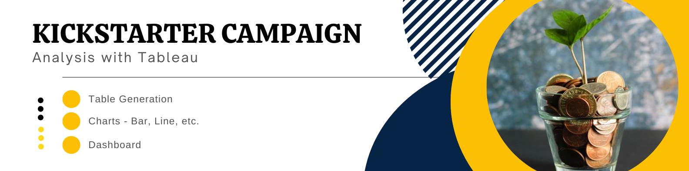
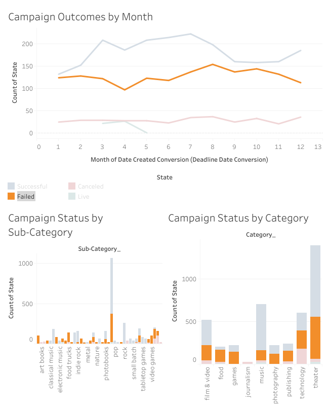

# tableau-kickstarter

Author:  Erin James Wills, ejw.data@gmail.com  

  
<cite>Photo by [micheile dot com](https://unsplash.com/@micheile?utm_source=unsplash&utm_medium=referral&utm_content=creditCopyText) on [Unsplash](https://unsplash.com/s/photos/money?utm_source=unsplash&utm_medium=referral&utm_content=creditCopyText)</cite>

 

## Overview  

  
Brief analysis of kickstarter campaigns that were also analyzed with pandas  

 

## Technologies    
*  Tableau

 

## Data Source  

The origins are unknown. The type of data matches what is on Kickstarter.com but 4,200 records is very small considering current campaigns (500,000 in 2022). A validated dataset should be obtained for a more serious analysis.  

 

## Setup and Installation  
1. The data file is found at https://github.com/ejw-data/excel-pivot-tables.  
1.  A copy of the tableau workbook is `Kickstarter_Campaign_v2022_1.twbx`.
1.  The dashboard can be viewed at https://ejw-data.github.io/tableau-citibike/.  

 

## Examples  

